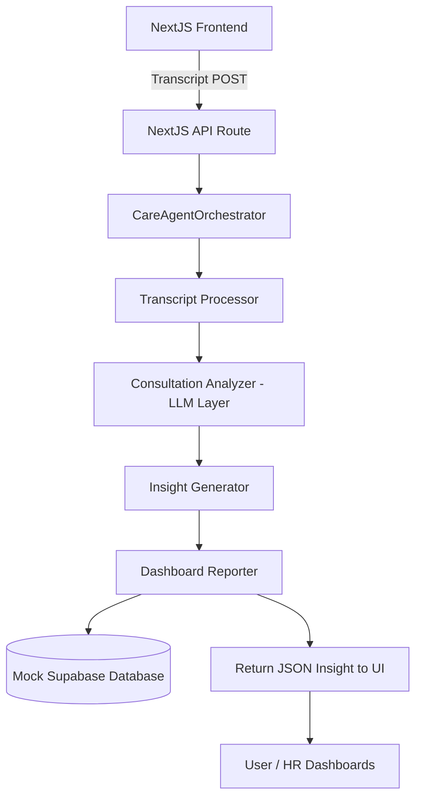

# CARE Agent — Consultation Analysis & Recommendation Engine

> **JSO Phase-2 · Agentic HR Consultation Monitoring System**

[](https://care-agent-olpzt4l2q-mdsvrs-projects.vercel.app/dashboard)
[](https://github.com/mdsvr/care-agent)

## 🌐 Live Links

| | Link |
|---|---|
| 🚀 **Live App (Vercel)** | https://care-agent-olpzt4l2q-mdsvrs-projects.vercel.app/dashboard |
| 💻 **GitHub Repository** | https://github.com/mdsvr/care-agent |

### Quick Demo Guide
1. Go to [**Upload Transcript**](https://care-agent-olpzt4l2q-mdsvrs-projects.vercel.app/upload)
2. Click **"Load Sample Transcript (Demo)"**
3. Click **"Run AI Analysis"** — watch all 4 agents process in real-time
4. View scores, tone chart, risk flags, and ethics note

---

A production-grade prototype of the CARE Agentic AI System, designed to monitor, analyze, and improve HR consultations using a 4-stage multi-agent pipeline.

## Features
- **Upload Transcript:** Paste or upload speaker-diarized text.
- **Multi-Agent Pipeline:** Simulates 4 discrete AI agents processing the data sequentially (Processor -> Analyzer -> Generator -> Reporter).
- **Interactive Dashboards:** Displays dynamic metrics using Shadcn UI and Recharts.
- **Premium UI:** Dark mode by default, utilizing Tailwind CSS for a modern, sleek aesthetic.

---

## 🛠 Tech Stack

- **Frontend:** Next.js 14 App Router, React, TailwindCSS, Recharts.
- **Backend:** Next.js API Routes (`/api/analyze-consultation`).
- **AI Agent Pipeline:** Custom orchestrated Node.js class pipeline (mocked for immediate Vercel deployment, ready to swap with OpenAI/Claude).
- **Styling:** Class variance authority (`clsx`, `tailwind-merge`).

---

## 🚀 Deployment Instructions (Vercel)

This application is fully contained and intentionally uses a mocked Supabase and AI logic so it can be deployed immediately without requiring external database or API key configurations.

1. **Push to GitHub**:
   ```bash
   git init
   git add .
   git commit -m "Initial commit of CARE Agent"
   git push -u origin main
   ```
2. **Import to Vercel**:
   - Go to [vercel.com](https://vercel.com/new).
   - Import your GitHub repository.
   - Click **Deploy**. Vercel will automatically detect Next.js and build the project flawlessly.
3. **Usage**:
   - Navigate to the deployment URL.
   - Go to the "Upload Transcript" page on the sidebar.
   - Paste a sample conversation and click "Run AI Analysis".

---

## 🏗 Architecture & Data Flow

### Architecture Diagram


### Data Flow
1. **User** uploads a consultation transcript via the `/upload` NextJS page.
2. The UI sends a POST request with the transcript to `/api/analyze-consultation`.
3. The API triggers the `CareAgentOrchestrator` which runs the 4-stage Multi-Agent pipeline.
4. The generated metrics (Scores) and Insights (Summary, Suggestions) are constructed.
5. (In production, data is stored in **Supabase** via PostgreSQL).
6. The JSON payload returns to the `UploadPage` frontend and updates the React state to display the gorgeous dynamic metric cards.

---

## 🤖 AI Agent Prompt Template

The AI Agent relies on the following prompt when swapped from the mock to a real LLM framework (e.g. `gpt-4o`):

```text
You are an expert HR Coach and Conversation Analyst.
Analyze the following HR consultation transcript and evaluate the HR Consultant's performance.

Evaluate mathematically on a scale of 0 to 10 for the following 4 metrics:
1. Professionalism (Tone, empathy)
2. Engagement (Talk-time ratio, active listening, interruptions)
3. Advice Quality (Actionability of feedback)
4. Communication Clarity (Conciseness, pacing)

Return the results IN STRICT JSON FORMAT exactly as follows:
{
  "professionalism_score": number,
  "engagement_score": number,
  "advice_quality_score": number,
  "communication_score": number,
  "summary": "2-3 sentences summarizing the session.",
  "hr_improvements": ["Tip 1", "Tip 2"],
  "candidate_suggestions": ["Tip 1", "Tip 2"]
}

Transcript:
"{transcript_text}"
```

---

*Authored for the AariyaTech Agentic AI Engineer Intern assignment.*
